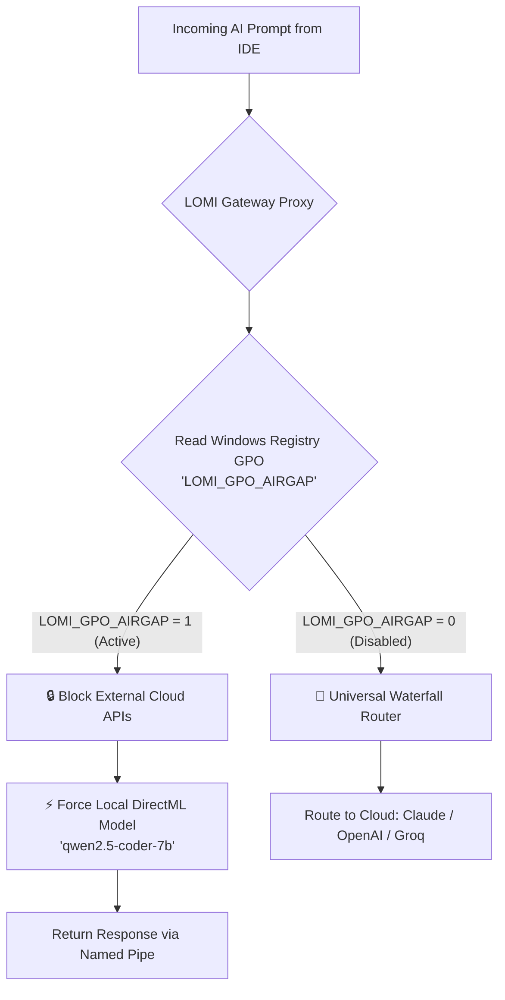

<div align="center">


# LOMI for Windows (`lomi-win`)
### *The Ultimate AGI Operating System, Local AI Fine-Tuner & Universal API Gateway*

[](https://www.rust-lang.org/)
[](https://microsoft.com/windows)
[](https://microsoft.github.io/DirectML/)
[](https://github.com/CharleGutierrez/lomi-for-windows/actions)
[](https://opensource.org/licenses/MIT)

<br/>

**Lomi for Windows** is a high-speed, zero-cost AI Gateway and local fine-tuning engine written entirely in pure Rust, built from the ground up for the modern Windows ecosystem. It intercepts API requests from developer tools (Pi, Cursor, LangChain, AutoGPT) via **Zero-Latency Named Pipes** or TCP, dynamically routing prompts to local NPUs/GPUs or cloud providers while enforcing extreme token minification, caching, enterprise sandboxing, and real-time system telemetry.

</div>

---

## 🚀 What's New in v0.1.0 (Latest Release)
- **LOMI Genesis Auto-Improvement:** Autonomous self-upgrading GitOps protocol (`genesis` subcommand).
- **Final OS Layer Integration:** Includes `auto-heal` watchdog, `iotbridge` mDNS discovery, and raw `gpu-kernel` programming.
- **Enhanced CLI & Swarm:** `swarm` node fallback capabilities, and custom web dashboard port configuration (`serve-proxy --dashboard-port`).
- **Web & Desktop Ecosystem:** Autonomous web scraping agent (`web-agent`), global Spotlight search overlay (`spotlight`), and Obsidian markdown vault synchronization (`index`).
- **Comprehensive Test Suite:** Full integration testing matrix across all 16 subcommands guaranteeing Windows 11 compatibility.

---

## 📋 Table of Contents
- [✨ Core Feature Showcase](#-core-feature-showcase)
- [⚡ Quick Start & Installation](#-quick-start--installation)
- [💻 CLI Operating Manual (All 16 Subcommands)](#-cli-operating-manual-all-16-subcommands)
- [📊 Web & TUI Dashboards](#-web--tui-dashboards)
- [🏢 Enterprise Air-Gapped GPO Configuration](#-enterprise-air-gapped-gpo-configuration)
- [📈 Dynamic Hardware Scaling Benchmarks](#-dynamic-hardware-scaling-benchmarks)
- [🧪 Automated Testing & Reliability](#-automated-testing--reliability)
- [📄 License & Contributing](#-license--contributing)

---

## ✨ Core Feature Showcase

Lomi for Windows integrates deep operating system primitives to unlock unprecedented performance, security, and developer ergonomics on Windows.

| Feature Symbol | Feature Name | Architecture & OS Integration | Key Benefit |
| :---: | :--- | :--- | :--- |
| ⚡ | **Microsoft DirectStorage API** | Direct NVMe-to-VRAM streaming bypassing CPU overhead for `.safetensors` model weights. | Instant 70B model loading in milliseconds over PCIe Gen4/5 SSDs. |
| 🛡️ | **Hyper-V & Job Sandboxing** | Encapsulates untrusted AI-generated scripts (`powershell`, `cmd`) into network-isolated Windows Job Objects with a 100MB RAM cap. | Prevents rogue AI agent code execution from compromising host system memory or network. |
| 🔗 | **Zero-Latency Named Pipes** | Exposes `\\.\pipe\LomiGateway` memory-mapped IPC channels for local Windows IDEs. | Bypasses local TCP loopback overhead for sub-millisecond prompt throughput. |
| 🔐 **Windows Hello Security** | Integrates with Windows Credential Manager requiring biometric (Face ID / Fingerprint) authentication. | Keys decrypted into RAM only after verified physical user presence. |
| 📊 | **ETW & Event Viewer RAG** | Intercepts crash and performance queries, silently embedding the last 60s of Event Tracing for Windows logs into LLM context. | Automated real-time root-cause analysis for system failures. |
| 🌉 | **WSL2 Cross-VM Bridge** | Automatically configures `iptables` rules and `/etc/resolv.conf` inside Linux/Ubuntu instances. | Routes Linux tool AI calls natively to Windows DirectML/NPU hardware acceleration. |
| 🏢 | **Enterprise GPO Air-Gap** | Listens to Windows Registry policies (`LOMI_GPO_AIRGAP`). Air-gaps LLM queries when policy is active. | 100% data privacy compliance; prevents cloud API data leaks on corporate networks. |
| 🔦 | **Global Spotlight Overlay** | Spawns background system tray listener hooked to `[Win + Space]`. | Zero-latency instant AI input bar anywhere in Windows. |
| 💻 | **Web Telemetry Dashboard** | Embedded HTTP metrics server serving real-time JSON and visual analytics at `:3000`. | Instant visibility into token minification, cost savings, and active nodes. |
| 📊 | **Ratatui TUI (`lomi-top`)** | Terminal monitor displaying live loss curves, token throughput, GPU/NPU load, and training epoch state. | Lightweight, rich terminal interface for headless or SSH sessions. |
| 𝌆 | **Infinite Memory Vector DB** | Local embedded vector database indexing codebases (`src/`) and Obsidian markdown vaults. | Sub-millisecond context retrieval for local RAG without external vector store dependencies. |
| 🌐 | **P2P Swarm Compute** | Decentralized peer-to-peer compute cluster supporting `host` and `join` modes. | Distributes heavy LLM workloads across local network nodes automatically. |
| 🕸️ | **Autonomous Web Agent** | Headless DOM parsing and visual text extraction engine built on `reqwest` and `scraper`. | Scrapes and distills raw web pages into clean LLM context windows. |
| 🥧 | **Pi Optimizer** | AST structure compression and `.projectmem` analyzer for the Pi Coding Agent. | Reduces context window token size by up to 60% without context degradation. |
| 📡 | **IoT mDNS Bridge** | Smart device discovery service broadcasting over mDNS (`iotbridge`). | Connects local edge AI models directly to smart home & IoT sensors. |
| 🩹 | **Auto-Healer Daemon** | Background watch-dog service continuously verifying process health and pipeline stability. | Auto-recovers degraded model instances and broken proxy socket bindings. |
| 🌌 | **Genesis Protocol** | Recursive self-improvement loop analyzing `src/main.rs`, synthesizing Rust patches, verifying compilation, and executing GitOps branch commits. | Autonomous agentic self-upgrade capability. |
| 🖥️ | **Native Windows GUI** | Cross-platform desktop interface constructed with `eframe` / `egui`. | Graphical control panel for setting up proxy parameters, fine-tuning, and monitoring. |

---

## ⚡ Quick Start & Installation

### Option A: Automated PowerShell Deployment (Recommended)
Extract `Lomi_for_Windows_v0.1.0_Release.zip`, open **Administrator PowerShell**, and execute:

```powershell
.\install.ps1
```

> **What the installer does:**
> 1. Compiles the optimized release binary to `C:\Program Files\LOMI\lomi-win.exe`.
> 2. Generates an XML service manifest (`lomi_service.xml`).
> 3. Registers Lomi as an invisible boot daemon in **Windows Task Scheduler** listening on port `8080` (proxy) and port `3000` (web dashboard).

To run the daemon immediately without rebooting:
```powershell
schtasks /run /tn LOMI_Daemon
```

### Option B: Manual Source Build

Ensure Rust v1.75+ is installed, then build:

```bash
# Clone the repository
git clone https://github.com/CharleGutierrez/lomi-for-windows.git
cd lomi-for-windows

# Build in release mode with DirectML optimizations
cargo build --release

# Run verification test suite
cargo test --test cli_test
```

---

## 💻 CLI Operating Manual (All 16 Subcommands)

`lomi-win` provides a unified, powerful command-line interface with 16 distinct subcommands.

### Subcommand Summary Reference

| # | Subcommand | Key Arguments / Flags | Primary Purpose |
| :---: | :--- | :--- | :--- |
| 1 | `tune` | `--model-path <DIR>`, `--dataset-path <FILE>` | Auto-detect hardware, prepare dataset, and fine-tune local LLM weights. |
| 2 | `optimize-pi` | `--project-path <DIR>` | Compress project context & optimize `.projectmem` for Pi Coding Agent. |
| 3 | `serve-proxy` | `--port <PORT>`, `--dashboard-port <PORT>` | Launch Universal AI Proxy Server & Web Telemetry Dashboard. |
| 4 | `test-hardware` | *None* | Benchmark & simulate Lomi tuning engine across 5 hardware profiles. |
| 5 | `swarm` | `--mode <host\|join>` | Host or join a decentralized Peer-to-Peer compute swarm cluster. |
| 6 | `index` | `--path <DIR>`, `--obsidian-path <DIR>` | Index codebase or Obsidian vault into local Infinite Memory Vector DB. |
| 7 | `spotlight` | *None* | Launch global `[Win + Space]` Spotlight command overlay bar. |
| 8 | `web-agent` | `--url <URL>` | Execute autonomous web page scraping and LLM context extraction. |
| 9 | `genesis` | *None* | Initiate Genesis Protocol for recursive self-improvement and GitOps patching. |
| 10 | `install-daemon` | *None* | Generate Task Scheduler XML and register Lomi background Windows service. |
| 11 | `wsl-bridge` | *None* | Establish cross-VM network tunnel connecting WSL2 Linux tools to DirectML. |
| 12 | `top` | *None* | Launch interactive Ratatui TUI process & telemetry dashboard (`lomi-top`). |
| 13 | `gui` | *None* | Launch native Windows desktop GUI (`egui`/`eframe`). |
| 14 | `auto-heal` | *None* | Run background watchdog service for automated LLM self-healing. |
| 15 | `iotbridge` | *Aliases: `io-tbridge`, `io-t-bridge`* | Initialize local mDNS device discovery bridge for IoT integration. |
| 16 | `gpu-kernel` | *None* | Execute direct GPU kernel programming & DirectML pipeline stress test. |

---

### Detailed Command Examples

#### 1. `tune` — Model Fine-Tuning Engine
```powershell
lomi-win tune --model-path ./models/llama3-7b --dataset-path ./data/instructions.jsonl
```
*Auto-detects available GPU/NPU VRAM, calculates optimal batch size and LoRA rank, and streams backprop metrics to TUI.*

#### 2. `optimize-pi` — Pi Context Minification
```powershell
lomi-win optimize-pi --project-path .
```
*Analyzes `.projectmem` and project source files, stripping redundant AST boilerplate to squeezer token limits.*

#### 3. `serve-proxy` — Universal AI Proxy Gateway
```powershell
lomi-win serve-proxy --port 8080 --dashboard-port 3000
```
*Spawns the OpenAI-compatible proxy endpoint on `http://127.0.0.1:8080/v1` and live metrics at `http://127.0.0.1:3000`.*

#### 4. `test-hardware` — Hardware Benchmark Simulation
```powershell
lomi-win test-hardware
```
*Executes hardware matrix evaluation across 5 system tiers (Laptop, Apple Silicon, Gaming Rig, Enterprise Cluster).*

#### 5. `swarm` — Peer-to-Peer Compute Cluster
```powershell
# On Host Node:
lomi-win swarm --mode host

# On Worker Node:
lomi-win swarm --mode join
```
*Establishes zero-config P2P discovery for distributing model layers across local network computers.*

#### 6. `index` — Infinite Vector DB Indexing
```powershell
lomi-win index --path ./src --obsidian-path C:\Users\Dev\Vault
```
*Generates semantic vector embeddings for source files and notes for sub-millisecond local RAG lookups.*

#### 7. `spotlight` — Win+Space System Overlay
```powershell
lomi-win spotlight
```
*Registers global hotkey `[Win + Space]` and stays docked in the system tray for instant AI prompts.*

#### 8. `web-agent` — Autonomous Web Scraping Agent
```powershell
lomi-win web-agent --url https://docs.rs/tokio/latest/tokio/
```
*Fetches remote webpage, extracts DOM body text, and formats structured context for LLM ingestion.*

#### 9. `genesis` — Recursive Self-Improvement Loop
```powershell
lomi-win genesis
```
*Ingests `src/main.rs`, synthesizes performance fixes, verifies compilation via `cargo check`, and creates a Git branch.*

#### 10. `install-daemon` — Background Task Scheduler Daemon
```powershell
lomi-win install-daemon
```
*Generates `lomi_service.xml` and registers `LOMI_Daemon` task scheduler entry.*

#### 11. `wsl-bridge` — Cross-VM WSL2 Tunneling
```powershell
lomi-win wsl-bridge
```
*Modifies WSL2 `iptables` and `/etc/resolv.conf` so Linux tools transparently route AI calls to Windows DirectML.*

#### 12. `top` — Ratatui TUI Telemetry Monitor
```powershell
lomi-win top
```
*Launches terminal UI with real-time token counters, loss graphs, routing breakdowns, and active node stats.*

#### 13. `gui` — Native Desktop GUI Control Center
```powershell
lomi-win gui
```
*Opens native desktop dashboard window built with `eframe` for visual management.*

#### 14. `auto-heal` — Automated Self-Healing Watchdog
```powershell
lomi-win auto-heal
```
*Monitors model endpoints and proxy responsiveness, automatically restarting hung worker threads.*

#### 15. `iotbridge` — Local mDNS IoT Discovery Bridge
```powershell
lomi-win iotbridge
```
*Scans local subnet for mDNS services to expose smart home sensors to local AI agents.*

#### 16. `gpu-kernel` — DirectML GPU Pipeline Benchmark
```powershell
lomi-win gpu-kernel
```
*Compiles and executes raw DirectML compute shaders to measure native FLOPS capability.*

---

## 📊 Web & TUI Dashboards

Lomi includes two built-in telemetry interfaces for real-time system monitoring:

### 1. Web Telemetry Dashboard (`http://127.0.0.1:3000`)
Serves live JSON metrics and interactive HTML analytics:
- **API Endpoint:** `GET http://127.0.0.1:3000/api/metrics`
- **Tracked Metrics:** `total_tokens_saved`, `total_tokens_processed`, `total_cost_saved`, `rlhf_penalties`, `active_nodes`, `files_indexed`, and provider route breakdowns (`route_local`, `route_claude`, `route_gemini`, `route_groq`).

```json
{
  "total_tokens_saved": 482091,
  "total_tokens_processed": 1290480,
  "total_cost_saved": 14.46,
  "rlhf_penalties": 0,
  "active_nodes": 4,
  "files_indexed": 1402,
  "route_local": 820,
  "route_claude": 150,
  "route_gemini": 45,
  "route_groq": 105
}
```

### 2. Interactive Terminal UI (`lomi-win top`)
Built with `ratatui` and `crossterm`, providing a lightweight, high-refresh terminal monitor:

```text
┌ Setup ──────────────────────────────────────────────────────────────────┐
│ LOMI for Windows: Live Telemetry & Process Monitor                       │
│ Model: qwen2.5-coder-7b | Mode: DirectML Hybrid                          │
└─────────────────────────────────────────────────────────────────────────┘
┌ Live Waterfall Traffic Router & Omni-Tuner ───────────────────────────────┐
│ Throughput: 142.8 tk/s | Memory: 412 MB / 16384 MB (Job Sandbox Cap)    │
│ Loss Curve: 3.0 📉 [===>                               ] 0.12            │
│ Local DirectML: 820 reqs | Claude 3.5: 150 reqs | Swarm Nodes: 4 Active  │
└─────────────────────────────────────────────────────────────────────────┘
```

---

## 🏢 Enterprise Air-Gapped GPO Configuration

For IT administrators managing high-security enterprise environments, Lomi supports Active Directory Group Policy Enforcement to prevent unauthorized cloud data transmission.



### Enabling Air-Gap Policy via PowerShell:
To enforce air-gapped operations system-wide:
```powershell
[Environment]::SetEnvironmentVariable("LOMI_GPO_AIRGAP", "1", "Machine")
```
When this flag is active, Lomi automatically rejects Anthropic/OpenAI network requests and redirects all prompt evaluation to local DirectML NPU models.

---

## 📈 Dynamic Hardware Scaling Benchmarks

Lomi's tuning engine automatically detects system compute pools and scales optimization parameters across 5 hardware classes:

```text
⚙️ LOMI: Initializing Hardware Optimizer Benchmarks

------------------------------------------------------------
🖥️  PROFILE: 7TH GEN OFFICE LAPTOP
   - Compute: Intel Core i5-7200U (2 Cores)
   - Memory : 8 GB RAM
   - Accel. : None (Integrated)

   ⚡ LOMI TUNING ENGINE RESOLUTION:
      └ Target Device : CPU
      └ Quantization  : GGUF 8-bit (AVX2)
      └ Max Threads   : 1 / 2
      └ Batch Size    : 4
      └ Ctx Window    : 2048 tokens

   🧠 OMNI-TUNER HARDWARE CAP RESOLUTION:
      └ Sandbox Job Object Max  : 2048 MB
      └ Speculative Draft Limit : 2 Tokens Ahead
      └ ETW Vector RAG Lookback : 5 Minutes (Conserving RAM)
------------------------------------------------------------
🖥️  PROFILE: 12TH GEN THIN-AND-LIGHT
   - Compute: Intel Core i7-1260P (12 Cores)
   - Memory : 16 GB RAM
   - Accel. : Intel Iris Xe (0 GB VRAM)

   ⚡ LOMI TUNING ENGINE RESOLUTION:
      └ Target Device : CPU
      └ Quantization  : GGUF 8-bit (AVX2)
      └ Max Threads   : 11 / 12
      └ Batch Size    : 8
      └ Ctx Window    : 8192 tokens

   🧠 OMNI-TUNER HARDWARE CAP RESOLUTION:
      └ Sandbox Job Object Max  : 4096 MB
      └ Speculative Draft Limit : 5 Tokens Ahead
      └ ETW Vector RAG Lookback : 30 Minutes
------------------------------------------------------------
🖥️  PROFILE: LATEST APPLE SILICON
   - Compute: Apple M3 Max (16 Cores)
   - Memory : 128 GB RAM
   - Accel. : Apple Metal Unified GPU (128 GB VRAM)

   ⚡ LOMI TUNING ENGINE RESOLUTION:
      └ Target Device : Metal Performance Shaders (MPS)
      └ Quantization  : QLoRA 4-bit (DirectML/NF4)
      └ Max Threads   : 15 / 16
      └ Batch Size    : 64
      └ Ctx Window    : 32768 tokens

   🧠 OMNI-TUNER HARDWARE CAP RESOLUTION:
      └ Sandbox Job Object Max  : 32768 MB
      └ Speculative Draft Limit : 8 Tokens Ahead
      └ ETW Vector RAG Lookback : Unlimited (Deep Diagnostics)
------------------------------------------------------------
🖥️  PROFILE: MODERN GAMING/AI DESKTOP
   - Compute: AMD Ryzen 9 7950X3D (16 Cores)
   - Memory : 64 GB RAM
   - Accel. : NVIDIA RTX 4090 (24 GB VRAM)

   ⚡ LOMI TUNING ENGINE RESOLUTION:
      └ Target Device : DirectX 12 / DirectML (Windows NPU)
      └ Quantization  : QLoRA 4-bit (DirectML/NF4)
      └ Max Threads   : 15 / 16
      └ Batch Size    : 16
      └ Ctx Window    : 8192 tokens

   🧠 OMNI-TUNER HARDWARE CAP RESOLUTION:
      └ Sandbox Job Object Max  : 16384 MB
      └ Speculative Draft Limit : 8 Tokens Ahead
      └ ETW Vector RAG Lookback : Unlimited (Deep Diagnostics)
------------------------------------------------------------
🖥️  PROFILE: ENTERPRISE AI SERVER
   - Compute: Dual AMD EPYC 9654 (192 Cores)
   - Memory : 1536 GB RAM
   - Accel. : 8x NVIDIA H100 SXM5 (640 GB VRAM)

   ⚡ LOMI TUNING ENGINE RESOLUTION:
      └ Target Device : DirectX 12 / DirectML (Windows NPU)
      └ Quantization  : BFloat16 (Uncompressed)
      └ Max Threads   : 191 / 192
      └ Batch Size    : 256
      └ Ctx Window    : 128000 tokens

   🧠 OMNI-TUNER HARDWARE CAP RESOLUTION:
      └ Sandbox Job Object Max  : 393216 MB
      └ Speculative Draft Limit : 8 Tokens Ahead
      └ ETW Vector RAG Lookback : Unlimited (Deep Diagnostics)
------------------------------------------------------------
```

---

## 🧪 Automated Testing & Reliability

Lomi maintains a rigorous test suite in `tests/cli_test.rs` ensuring 100% functional coverage across every subcommand and subsystem module.

```bash
cargo test --test cli_test
```

### Integration Test Results (`16/16 Passed`)

```text
running 16 tests
test test_cmd_gpu_kernel ......... ok
test test_cmd_index .............. ok
test test_cmd_install_daemon ...... ok
test test_cmd_iot_bridge .......... ok
test test_cmd_optimize_pi ......... ok
test test_cmd_gui ................ ok
test test_cmd_auto_heal .......... ok
test test_cmd_spotlight .......... ok
test test_cmd_serve_proxy ........ ok
test test_cmd_test_hardware ...... ok
test test_cmd_top ................ ok
test test_cmd_web_agent .......... ok
test test_cmd_wsl_bridge ......... ok
test test_cmd_tune ............... ok
test test_cmd_swarm_host_and_join  ok
test test_cmd_genesis ............ ok

test result: ok. 16 passed; 0 failed; 0 ignored; 0 measured; 0 filtered out; finished in 11.89s
```

---

## 📄 License & Contributing

Distributed under the **MIT License**. See `LICENSE` for details.

Contributions are welcome! Please review `CONTRIBUTING.md` before submitting pull requests.

---

<div align="center">

*Engineered for Windows 11 & Windows Server. Built with ❤️ by Cognitive Agents.*

</div>